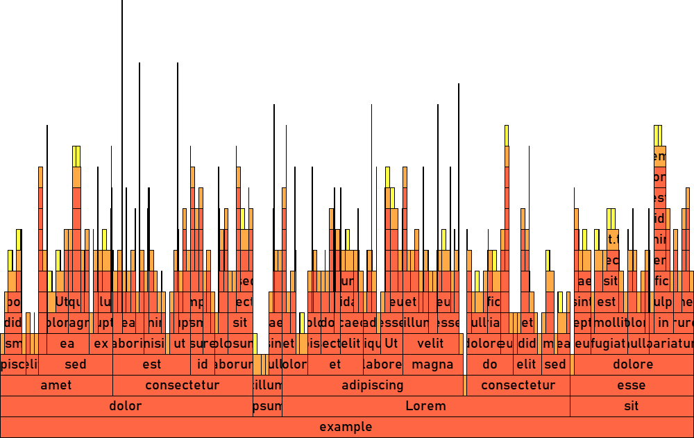
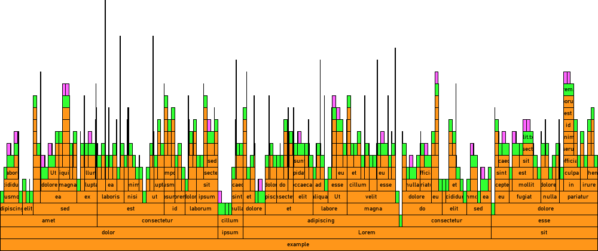

# WinFlame

Create flame graphs to visualize file storage space.

These can be useful for simultaneously identifying which files and folders are taking up the most storage on your system. For privacy reasons I do not have any example graphs of a full drive scan on this page, but that is a good use for this program.

\
_In this example, the red-orange blocks are directories, the orange blocks are files, and the yellow blocks are alternate data streams. The width of the blocks is proportional to their size on disk._

This example was generated with the command `winflame -b example -FPw 1000 -H 30 -G 20 -B #0000 -0 #f64f -1 #fa4f -2 #ff4f`,
after generating the `example` folder using [a small tool I made](generate_example.py). However, if you don't care about customization, one as
simple as `winflame -b example -PFw 1000` would do.

Here's what that would give:\

... TODO ...

## Requirements

- Windows
- Python 3.10+

## Installation

... TODO ...

- [pywin32](https://pypi.org/project/pywin32/)
- [pillow](https://pypi.org/project/pillow/)
